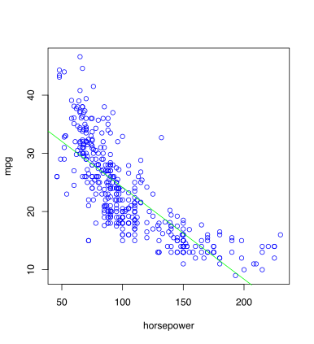

# Home work 1

## 1. Please use the lm() function to perform a simple linear regression with mpg as the response and horsepower as the predictor

```R
library (ISLR)
Auto=read.table ("Auto.data", header =T,na.strings ="?")
attach(Auto)
names(Auto)
```
Output:
```
[1] "mpg"          "cylinders"    "displacement"
[4] "horsepower"   "weight"       "acceleration"
[7] "year"         "origin"       "name"
```

### a. Is there a relationship between the predictor and the response?

There is a negative potentialy non-linear relationsip between `horsepower` and `mpg` (miles per gallon) according to visaul analisys.

```R
pairs(~ mpg + horsepower, Auto)
```


### Simple linear regression with mpg as the response and horsepower as the predictor

```R
lm.fit =lm(mpg~horsepower ,data=Auto,subset=train)
summary(lm.fit)
```


```
Call:
lm(formula = mpg ~ horsepower, data = Auto, subset = train)

Residuals:
     Min       1Q   Median       3Q      Max 
-13.9927  -3.3274  -0.3231   2.8258  16.5115 

Coefficients:
             Estimate Std. Error t value Pr(>|t|)    
(Intercept) 40.263828   0.982438   40.98   <2e-16 ***
horsepower  -0.156543   0.008742  -17.91   <2e-16 ***
---
Signif. codes:  0 ‘***’ 0.001 ‘**’ 0.01 ‘*’ 0.05 ‘.’ 0.1 ‘ ’ 1

Residual standard error: 5.028 on 194 degrees of freedom
Multiple R-squared:  0.6231,	Adjusted R-squared:  0.6211 
F-statistic: 320.7 on 1 and 194 DF,  p-value: < 2.2e-16
```

### b. How strong is the relationship between the predictor and the response?

The relationship is strong: 
* R-squared is 0.6211  meaning that 62.11% of the variability in `mpg` can be explained by `horsepower``


### c. Is the relationship between the predictor and the response positive or negative?

The relationship is `Negative`: the slope is `-0.156543`
```
horsepower  -0.156543
```

### d. What is the predicted mpg associated with a horsepower of 98?

`24.46708`

#### d.1 What are the associated 95% confidence intervals?
```R
predict (lm.fit, level = 0.95, data.frame(horsepower=98 ), interval ="confidence")
```
Outputs:
```
fit      lwr      upr
1 24.46708 23.97308 24.96108
```
#### d.2 What are the associated 95% prediction intervals?
```R
predict(lm.fit, level = 0.95, data.frame(horsepower = 98), interval = "prediction")
```
Outputs:
```
fit     lwr      upr
1 24.46708 14.8094 34.12476

```
### Fitted Model


### Fit parameters


### e. Plot the response and the predictor. Please use the abline() function to display the least squares regression line.
```R
plot(horsepower ,mpg)
abline (lm.fit)
```


## 
