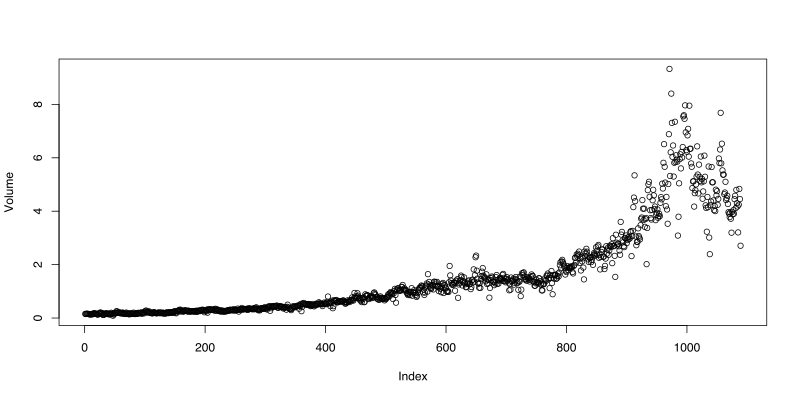

# Home Work 2

##(Question #10 from chapter 4)

This question should be answered using the Weekly data set, which is part of the ISLR package. This data is similar in nature to the Smarket data from this chapter’s lab, except that it contains 1089 weekly returns for 21 years, from the beginning of 1990 to the end of 2010.
```R
> library (ISLR)
> names(Weekly)
[1] "Year"      "Lag1"      "Lag2"      "Lag3"      "Lag4"      "Lag5"      "Volume"    "Today"     "Direction"

```
### (a) Produce some numerical and graphical summaries of the Weekly data. Do there appear to be any patterns?
```R
> summary (Weekly)
      Year           Lag1               Lag2               Lag3               Lag4               Lag5         
 Min.   :1990   Min.   :-18.1950   Min.   :-18.1950   Min.   :-18.1950   Min.   :-18.1950   Min.   :-18.1950  
 1st Qu.:1995   1st Qu.: -1.1540   1st Qu.: -1.1540   1st Qu.: -1.1580   1st Qu.: -1.1580   1st Qu.: -1.1660  
 Median :2000   Median :  0.2410   Median :  0.2410   Median :  0.2410   Median :  0.2380   Median :  0.2340  
 Mean   :2000   Mean   :  0.1506   Mean   :  0.1511   Mean   :  0.1472   Mean   :  0.1458   Mean   :  0.1399  
 3rd Qu.:2005   3rd Qu.:  1.4050   3rd Qu.:  1.4090   3rd Qu.:  1.4090   3rd Qu.:  1.4090   3rd Qu.:  1.4050  
 Max.   :2010   Max.   : 12.0260   Max.   : 12.0260   Max.   : 12.0260   Max.   : 12.0260   Max.   : 12.0260  
     Volume            Today          Direction 
 Min.   :0.08747   Min.   :-18.1950   Down:484  
 1st Qu.:0.33202   1st Qu.: -1.1540   Up  :605  
 Median :1.00268   Median :  0.2410             
 Mean   :1.57462   Mean   :  0.1499             
 3rd Qu.:2.05373   3rd Qu.:  1.4050             
 Max.   :9.32821   Max.   : 12.0260             
 ```
 
 Draw the correlation matrix

```R
pairs(Weekly [,1:8])
```

![pairs(Weekly [,1:8])](Rplot2-1.svg)

```R
> plot(Volume)
```



Volume corelates to the week number. Other relations are not so clear.


### (b) Use the full data set to perform a logistic regression with Direction as the response and the five lag variables plus Volume as predictors. Use the summary function to print the results. Do any of the predictors appear to be statistically significant? If so, which ones?

```R
> glm.fits=glm(Direction~Lag1+Lag2+Lag3+Lag4+Lag5+Volume , data=Weekly ,family=binomial)
> summary (glm.fits)

Call:
glm(formula = Direction ~ Lag1 + Lag2 + Lag3 + Lag4 + Lag5 + 
    Volume, family = binomial, data = Weekly)

Deviance Residuals: 
    Min       1Q   Median       3Q      Max  
-1.6949  -1.2565   0.9913   1.0849   1.4579  

Coefficients:
            Estimate Std. Error z value Pr(>|z|)   
(Intercept)  0.26686    0.08593   3.106   0.0019 **
Lag1        -0.04127    0.02641  -1.563   0.1181   
__Lag2         0.05844    0.02686   2.175   0.0296 *__
Lag3        -0.01606    0.02666  -0.602   0.5469   
Lag4        -0.02779    0.02646  -1.050   0.2937   
Lag5        -0.01447    0.02638  -0.549   0.5833   
Volume      -0.02274    0.03690  -0.616   0.5377   
---
Signif. codes:  0 ‘***’ 0.001 ‘**’ 0.01 ‘*’ 0.05 ‘.’ 0.1 ‘ ’ 1

(Dispersion parameter for binomial family taken to be 1)

    Null deviance: 1496.2  on 1088  degrees of freedom
Residual deviance: 1486.4  on 1082  degrees of freedom
AIC: 1500.4

Number of Fisher Scoring iterations: 4

> coef(glm.fits)
(Intercept)        Lag1        Lag2        Lag3        Lag4        Lag5 
 0.26686414 -0.04126894  0.05844168 -0.01606114 -0.02779021 -0.01447206 
     Volume 
-0.02274153 

```

**The `Lag2` appears to be the predictor that contribute the most.**

### (c) Compute the confusion matrix and overall fraction of correct predictions. Explain what the confusion matrix is telling you about the types of mistakes made by logistic regression.

```R
> glm.pred =predict(glm.fits,type ="response")
> contrasts(Direction)
     Up
Down  0
Up    1
> glm.prob=rep ("Down" ,1089)
> glm.prob[glm.pred >.5]="Up"
> ## 
> table(glm.prob,Direction )
        Direction
glm.prob Down  Up
    Down   54  48
    Up    430 557
>
```
Interpretation:
```
| Direction |                |                 |      |
| glm.prob  | Down           | Up              |      |
| Down      | True Down=  54 | False Down=  48 |  102 |
| Up        | False Up=  430 | True Up=    557 |  987 |
| totals    | 484            | 605             | 1089 |

```

Let's assume "Positive" is to predict "Up"

* Accuracy: Overall, how often is the classifier correct?
(True Down +True Up)/total = (54+557)/1089 = 0.56
__The 56% of time the classifier able to accuratly predict.__

* Misclassification Rate: Overall, how often is it wrong?
(Fase Down + False Up)/total = (430+48)/1089 = 0.44
__Error Rate is 44%. It is also (1 - Accuracy)__

* True Positive Rate: When it's actually __Up__, how often does it predict __Up__?
True Down/actual Down = 557/987 = 0.56
__It is 56%. This value is also known as "Sensitivity" or "Recall"__

* False Positive Rate: When it's actually __Down__, how often does it predict __Up__?
FP/actual  = 48/102 = 0.47
__It is 47%__

* True Negative Rate (also known as "Specificity"): When it's actually __Down__, how often does it predict __Down__?
TN/actual no = 54/102 = 0.53
__It is 53%. Also it is (1 -  False Positive Rate)__

* Precision: When it predicts __Up__, how often is it correct?
TP/predicted __Up__ = 557/605 = 0.92

* Prevalence: How often does the __Up__ condition actually occur in our sample?
actual Up/total Up = 987/1089 = 0.906


### (d) Now fit the logistic regression model using a training data period from 1990 to 2008, with Lag2 as the only predictor. Compute the confusion matrix and the overall fraction of correct predictions for the held out data (that is, the data from 2009 and 2010).
### (e) Repeat (d) using LDA.
### (f) Repeat (d) using QDA.
### (g) Repeat (d) using KNN with K = 1.
### (h) Which of these methods appears to provide the best results on this data?
### (i) Experiment with different combinations of predictors, including possible transformations and interactions, for each of the methods. Report the variables, method, and associated confusion matrix that appears to provide the best results on the held out data. Note that you should also experiment with values for K in the KNN classifier.

