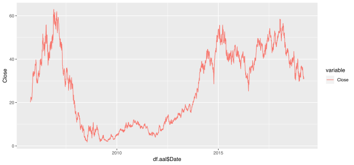
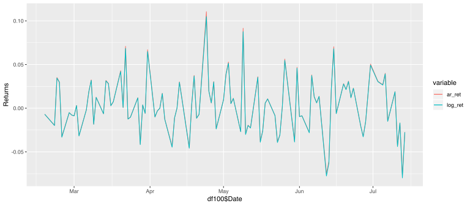
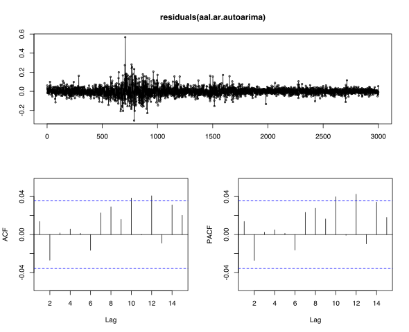

# Time Series Analisys
This is the report on the course final project for DSA 6100: Statistical Methods for Data Science and Analytics
By 
* Igor Ostaptchenko <igor_ost@wayne.edu>
* Ali Milhem <gu...@wayne.edu>

The `R` source for this report is: 
The datasets: 
* AAL Daily: 
* REL Daily: 


## Time Series Analisys

TODO Ali

## Finantial data

TODO Ali - describe common sources and properties of fin tech data

### AAL
TODO Ali - describe this dataset - chart shows only `close`



### REL

TODO Ali 


## Fitting ARIMA

### Stationarity

Let's asses the Stationarity of AAL and REL `Close` price values 

#### The Augmented Dickey-Fuller Test 
For the daily `Close` prices of AAL time series :

```
> print(adf.test(df.aal$Close,alternative = "stationary"))

	Augmented Dickey-Fuller Test

data:  df.aal$Close
Dickey-Fuller = -1.4708, Lag order = 15, p-value = 0.8024
alternative hypothesis: stationary
```

For the daily `Close` prices of REL time series :

```
> print(adf.test(df.rel$Close,alternative = "stationary"))

	Augmented Dickey-Fuller Test

data:  df.rel$Close
Dickey-Fuller = -1.3671, Lag order = 17, p-value = 0.8464
alternative hypothesis: stationary
```

TODO Ali - write up the conclusion and motivation to do fitting on Returns instead 


### Moving focus to Arithmetic and Log Returns
TODO Ali - write up the rules and formulas for returns 

#### Transform `Close` prices to `Returns`
The `R` functions to calculate returns are as follows:

```r
ar_ret <- function(P) {c(NA, P[2:length(P)]/P[1:(length(P)-1)] -1)}
log_ret <- function(P) {c(NA, log(P[2:length(P)]/P[1:(length(P)-1)]))}
```

These functions will be applyed to the `Close` price vector and create two more columns `ar_ret` and `log_ret`

```
> df.aal$ar_ret <- ar_ret(df.aal$Close)
> df.aal$log_ret <- log_ret(df.aal$Close)
> head(df.aal)
        Date Close      ar_ret     log_ret
1 2005-09-27 19.30          NA          NA
2 2005-09-28 20.50  0.06217617  0.06031979
3 2005-09-29 20.21 -0.01414634 -0.01424735
4 2005-09-30 21.01  0.03958436  0.03882098
5 2005-10-03 21.50  0.02332223  0.02305442
6 2005-10-04 22.16  0.03069767  0.03023593
```
Notice that first row has blank returns. The first record will be dropped in future calculations


##### AAL


TODO Ali - write interpretation

##### Reliance


TODO Ali - write interpretation

##### Closer look on returns



#### The Augmented Dickey-Fuller Test on Returns

TODO Ali - write interpretation comparing values with ADF of `Close` above??

```
> # ADF test on ariphmetic return
> print(adf.test(df.aal$ar_ret, alternative = "stationary"))

	Augmented Dickey-Fuller Test

data:  df.aal$ar_ret
Dickey-Fuller = -13.646, Lag order = 15, p-value = 0.01
alternative hypothesis: stationary

Warning message:
In adf.test(df.aal$ar_ret, alternative = "stationary") :
  p-value smaller than printed p-value
> # ADF test on log return
> print(adf.test(df.aal$log_ret, alternative = "stationary"))

	Augmented Dickey-Fuller Test

data:  df.aal$log_ret
Dickey-Fuller = -13.709, Lag order = 15, p-value = 0.01
alternative hypothesis: stationary

Warning message:
In adf.test(df.aal$log_ret, alternative = "stationary") :
  p-value smaller than printed p-value
> # ADF test on return
> print(adf.test(df.rel$ar_ret, alternative = "stationary"))

	Augmented Dickey-Fuller Test

data:  df.rel$ar_ret
Dickey-Fuller = -18.868, Lag order = 17, p-value = 0.01
alternative hypothesis: stationary

Warning message:
In adf.test(df.rel$ar_ret, alternative = "stationary") :
  p-value smaller than printed p-value
> print(adf.test(df.rel$log_ret, alternative = "stationary"))

	Augmented Dickey-Fuller Test

data:  df.rel$log_ret
Dickey-Fuller = -18.717, Lag order = 17, p-value = 0.01
alternative hypothesis: stationary

Warning message:
In adf.test(df.rel$log_ret, alternative = "stationary") :
  p-value smaller than printed p-value
```

Conclusion: the Arithmetic and Log Returns hastime series is stationary properties thus allowing to apply ARIMA class models to forecast the time series.

###  Use Auto.Arima

The `R`s `forecast` package provides `auto.arima` function to select best ARIMA model according to either AIC, AICc or BIC value. The function conducts a search over possible model within the order constraints provided.

The first 3000 returns of `AAL` dataset will be used to train the model.

#### Find the best model for 3000 observations of `AAL` 

```
> aal.ar.autoarima <- auto.arima(df.aal[1:3000,]$ar_ret,
+                                max.order=300,
+                                trace = TRUE)

 Fitting models using approximations to speed things up...

 ARIMA(2,0,2) with non-zero mean : -10161.53
 ARIMA(0,0,0) with non-zero mean : -10158.63
 ARIMA(1,0,0) with non-zero mean : -10161.04
 ARIMA(0,0,1) with non-zero mean : -10160
 ARIMA(0,0,0) with zero mean     : -10158.25
 ARIMA(1,0,2) with non-zero mean : -10158.91
 ARIMA(2,0,1) with non-zero mean : -10158.22
 ARIMA(3,0,2) with non-zero mean : -10164.8
 ARIMA(3,0,1) with non-zero mean : -10156.83
 ARIMA(4,0,2) with non-zero mean : -10155.13
 ARIMA(3,0,3) with non-zero mean : -10177.41
 ARIMA(2,0,3) with non-zero mean : -10154.9
 ARIMA(4,0,3) with non-zero mean : -10164.45
 ARIMA(3,0,4) with non-zero mean : -10164.72
 ARIMA(2,0,4) with non-zero mean : -10156.56
 ARIMA(4,0,4) with non-zero mean : -10162.49
 ARIMA(3,0,3) with zero mean     : -10177.19

 Now re-fitting the best model(s) without approximations...

 ARIMA(3,0,3) with non-zero mean : -10184.57

 Best model: ARIMA(3,0,3) with non-zero mean 
 ```

For `ariphmetic` returns the best model is ARIMA(_p_ =3, _d_ = 0, _q_ = 3). Note that _d_ is 0 because the `Returns` is already a differentiated measure.

Let's see about `Log Returns`

```
> aal.ar.autoarima.log <- auto.arima(df.aal[1:3000,]$log_ret,
+                                max.order=300,
+                                trace = TRUE)

 Fitting models using approximations to speed things up...

 ARIMA(2,0,2) with non-zero mean : -10229.61
 ARIMA(0,0,0) with non-zero mean : -10226.48
 ARIMA(1,0,0) with non-zero mean : -10228.72
 ARIMA(0,0,1) with non-zero mean : -10227.68
 ARIMA(0,0,0) with zero mean     : -10228.36
 ARIMA(1,0,2) with non-zero mean : -10226.69
 ARIMA(2,0,1) with non-zero mean : -10226.01
 ARIMA(3,0,2) with non-zero mean : -10239.06
 ARIMA(3,0,1) with non-zero mean : -10224.36
 ARIMA(4,0,2) with non-zero mean : -10220.88
 ARIMA(3,0,3) with non-zero mean : -10244.42
 ARIMA(2,0,3) with non-zero mean : -10222.57
 ARIMA(4,0,3) with non-zero mean : -10230.23
 ARIMA(3,0,4) with non-zero mean : -10230.58
 ARIMA(2,0,4) with non-zero mean : -10222.16
 ARIMA(4,0,4) with non-zero mean : -10246.03
 ARIMA(5,0,4) with non-zero mean : -10245.72
 ARIMA(4,0,5) with non-zero mean : -10247.3
 ARIMA(3,0,5) with non-zero mean : -10243.32
 ARIMA(5,0,5) with non-zero mean : -10245.82
 ARIMA(4,0,5) with zero mean     : -10249.5
 ARIMA(3,0,5) with zero mean     : -10245.2
 ARIMA(4,0,4) with zero mean     : -10240.45
 ARIMA(5,0,5) with zero mean     : -10246.98
 ARIMA(3,0,4) with zero mean     : -10232.42
 ARIMA(5,0,4) with zero mean     : -10248.12

 Now re-fitting the best model(s) without approximations...

 ARIMA(4,0,5) with zero mean     : -10250.27

 Best model: ARIMA(4,0,5) with zero mean     
 ```

For `Log` returns the best model is ARIMA(_p_ = 4, _d_ = 0, _q_ = 5). Same: _d_ is 0 because the `Log Returns` is already a differentiated measure.

Let's asses the selected model parameters.

##### Arithemtic returns fit

```
> print(aal.ar.autoarima)
Series: df.aal[1:3000, ]$ar_ret 
ARIMA(3,0,3) with non-zero mean 

Coefficients:
         ar1     ar2      ar3      ma1      ma2     ma3    mean
      0.5436  0.5205  -0.8897  -0.5292  -0.4805  0.8788  0.0013
s.e.  0.0424  0.0552   0.0325   0.0440   0.0568  0.0374  0.0008

sigma^2 estimated as 0.001958:  log likelihood=5100.31
AIC=-10184.62   AICc=-10184.57   BIC=-10136.57
```

##### Log Returns Fit

```
> print(aal.ar.autoarima.log)
Series: df.aal[1:3000, ]$log_ret 
ARIMA(4,0,5) with zero mean 

Coefficients:
         ar1     ar2     ar3      ar4      ma1      ma2      ma3     ma4      ma5
      0.1674  0.1579  0.1176  -0.8557  -0.1406  -0.1308  -0.1099  0.8818  -0.0110
s.e.  0.2363  0.2416  0.1131   0.1287   0.2400   0.2168   0.0880  0.1263   0.0422

sigma^2 estimated as 0.001914:  log likelihood=5135.17
AIC=-10250.35   AICc=-10250.27   BIC=-10190.28
```
TODO ALi - explain what model is better comparing AIC, BIC and other params??

#### Assessing Residuals of the Arithmetic and Log Returns fits

Arithemtic Returns Fit Residuals:



Log Returns Fit Residuals:


#### Find the best model for 5500 observations of `REL` 

