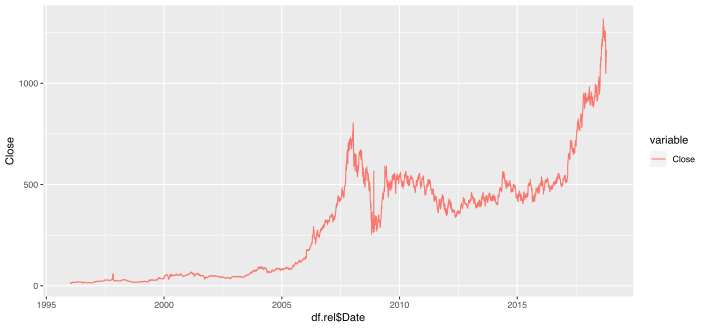

# Time Series Analisys
This is the report on the course final project for DSA 6100: Statistical Methods for Data Science and Analytics
By 
* Igor Ostaptchenko <igor_ost@wayne.edu>
* Ali Milhem <gu...@wayne.edu>

## Time Series Analisys

## Finantial data

### AAL


### REL



## Fitting ARIMA

### Stationarity

Let's asses the Stationarity of AAL and REL `Close` price values 

#### The Augmented Dickey-Fuller Test 
For the daily `Close` prices of AAL time series :

```
> print(adf.test(df.aal$Close,alternative = "stationary"))

	Augmented Dickey-Fuller Test

data:  df.aal$Close
Dickey-Fuller = -1.4708, Lag order = 15, p-value = 0.8024
alternative hypothesis: stationary
```

For the daily `Close` prices of REL time series :

```
> print(adf.test(df.rel$Close,alternative = "stationary"))

	Augmented Dickey-Fuller Test

data:  df.rel$Close
Dickey-Fuller = -1.3671, Lag order = 17, p-value = 0.8464
alternative hypothesis: stationary
```

TODO Ali - write up the conclusion and motivation to do fitting on Returns instead 


### Moving focus to Arithmetic and Log Returns
TODO Ali - write up the rules and formulas for returns 

#### Transform `Close` prices to `Returns`
The `R` functions to calculate returns are as follows:

```r
ar_ret <- function(P) {c(NA, P[2:length(P)]/P[1:(length(P)-1)] -1)}
log_ret <- function(P) {c(NA, log(P[2:length(P)]/P[1:(length(P)-1)]))}
```

These functions will be applyed to the `Close` price vector and create two more columns `ar_ret` and `log_ret`

```
> df.aal$ar_ret <- ar_ret(df.aal$Close)
> df.aal$log_ret <- log_ret(df.aal$Close)
> head(df.aal)
        Date Close      ar_ret     log_ret
1 2005-09-27 19.30          NA          NA
2 2005-09-28 20.50  0.06217617  0.06031979
3 2005-09-29 20.21 -0.01414634 -0.01424735
4 2005-09-30 21.01  0.03958436  0.03882098
5 2005-10-03 21.50  0.02332223  0.02305442
6 2005-10-04 22.16  0.03069767  0.03023593
```
Notice that first row has blank returns. The first record will be dropped in future calculations


##### AAL


TODO Ali - write interpretation

##### Reliance


TODO Ali - write interpretation

##### Closer look on returns


##### The Augmented Dickey-Fuller Test on Returns

TODO Ali - write interpretation comparing values with ADF of `Close` above??

```
> # ADF test on ariphmetic return
> print(adf.test(df.aal$ar_ret, alternative = "stationary"))

	Augmented Dickey-Fuller Test

data:  df.aal$ar_ret
Dickey-Fuller = -13.646, Lag order = 15, p-value = 0.01
alternative hypothesis: stationary

Warning message:
In adf.test(df.aal$ar_ret, alternative = "stationary") :
  p-value smaller than printed p-value
> # ADF test on log return
> print(adf.test(df.aal$log_ret, alternative = "stationary"))

	Augmented Dickey-Fuller Test

data:  df.aal$log_ret
Dickey-Fuller = -13.709, Lag order = 15, p-value = 0.01
alternative hypothesis: stationary

Warning message:
In adf.test(df.aal$log_ret, alternative = "stationary") :
  p-value smaller than printed p-value
> # ADF test on return
> print(adf.test(df.rel$ar_ret, alternative = "stationary"))

	Augmented Dickey-Fuller Test

data:  df.rel$ar_ret
Dickey-Fuller = -18.868, Lag order = 17, p-value = 0.01
alternative hypothesis: stationary

Warning message:
In adf.test(df.rel$ar_ret, alternative = "stationary") :
  p-value smaller than printed p-value
> print(adf.test(df.rel$log_ret, alternative = "stationary"))

	Augmented Dickey-Fuller Test

data:  df.rel$log_ret
Dickey-Fuller = -18.717, Lag order = 17, p-value = 0.01
alternative hypothesis: stationary

Warning message:
In adf.test(df.rel$log_ret, alternative = "stationary") :
  p-value smaller than printed p-value
```

Conclusion: the Arithmetic and Log Returns hastime series is stationary properties thus allowing to apply ARIMA class models to forecast the time series.
